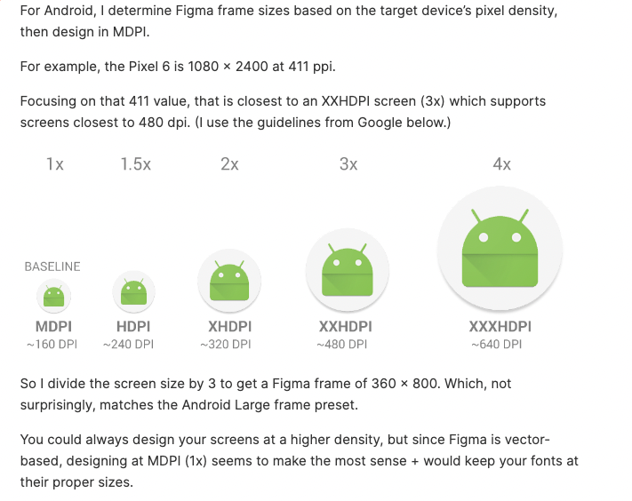

360x800

기본 해상도
가로 : 360px
세로 : 640px?

- iOS. 375x812,,,, figma,375x667
- AOS : 360x800,,,, figma,360x640

 figma : 360 h 760 

 1. 디자인 가이드는 1배수 기준으로 받는다.
 - iOS. 375x812
 - AOS : 360x800
 * 급할경우 안드로이드만 받아서 혼용가능.

2. 리소스(아이콘이나 이미지) 는 1배수 , 2배수, 3배수 를 받는다.
 - 375x812 에서 표기되는 20 x 20 이미지의 경우 전달시 20x20 , 40x40, 60x60 3장 필요
 

 - baseline, 1x, mdpi, 160dpi
 - 1.5x, hdpi, 240dpi
 - 2x, xhdpi, 320dpi
 - 3x, xxhdpi, 480dpi
 - 4x, xxxhdpi, 640dpi

 3x or xxhdpi = 1080x2400