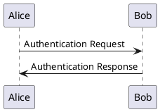
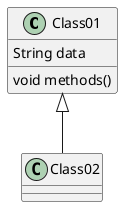

# 시퀀스 다이어그램

```plantuml
@startuml
Alice -> Bob: Authentication Request
Alice <- Bob: Authentication Response
@enduml
```
# 클래스 다이어그램

```plantuml
@startuml
class Class01 {
  String data
  void methods()
}
Class01 <|-- Class02
@enduml
```

설치 및 실행 명령
```sh
brew install Plantuml
plantuml filename.txt
```

# 참고
[글로 다이어그램을 그려요 – PlantUML](http://meetup.toast.com/posts/117)
